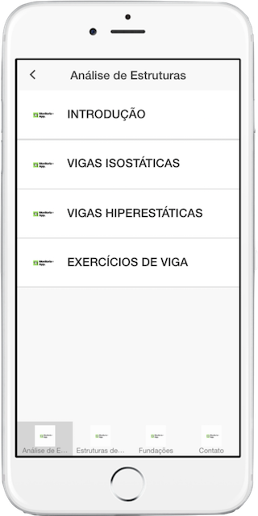
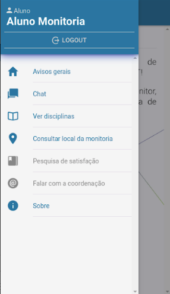

 

## 1. Introdução

 

 Esse documento tem como propósito demonstrar a visão geral, as características, reunir as funcionalidades, requisitos e os objetivos do aplicativo web a ser produzido. Fornece uma visão unificada das necessidades e expectativas do cliente em relação ao software, além de ajudar a reduzir riscos.

 Muitos alunos no meio acadêmico possuem dificuldades de aprendizado durante seus estudos tradicionais, através disso foi idealizado um ambiente agradável que possibilitasse que alunos pudessem trocar informações com a realização de monitorias.

## 2. Objetivos

 

- Criar uma aplicação que visa facilitar a relação entre monitores e estudantes
- Agilizar o processo de agendamento de encontros com monitores, sobrando assim mais tempo para o aluno se dedicar aos estudos

## 3. Descrição do usuário

 

O aplicativo web tem como finalidade viabilizar e flexibilizar as monitorias e encontros de estudos. Os usuários serão discentes que poderão optar por ministrar monitorias, ou optar por participar da monitoria como aluno interessado. Destarte o aplicativo irá facilitar o encontro entre os usuários possibilitando um maior fluxo de informações de maneira simples e eficiente.

### 3.1 Usuários

 

|Tipo|Descrição|Responsabilidade|
|:------:|:------:|:--------:|
|Aluno|Aluno ministrante/ministrado|Cadastrar monitorias/Buscar monitorias de seu interesse|

### 3.2 Principais Necessidade do Usuários

 

|Necessidade|Prioridade|Interesses|Solução atual|Solução proposta|
|:------:|:-------:|:------:|:-------:|:------:|
|Encontrar monitoria|Alta|Encontrar monitoria que necessita|Monitorias formais, ministradas por alunos selecionados pelo professor|buscar monitorias e ajudas de alunos que tenham interesse em ministrar|
|Agendar monitoria|Alta|Conseguir monitorias em horários diversos|Monitorias com horários pré-definidos|selecionar monitorias em melhores horários|
|Estimular alunos para ajudar|Baixa|Ajudar ao próximo|Créditos|Sistema de ranking para as melhores monitorias|

## 4. Envolvidos

 

|Nome|Descrição|Principais responsabilidades|
|:-------:|:-------:|:-----:|
|Bruna Nayara |Orientadora e avaliadora do projeto e produto|Orientar e direcionar o desenvolvimento do projeto|
|Carla Silva|Orientadora e avaliadora do projeto e produto|Orientar e direcionar a equipe de EPS|
|João Pedro Soares|Membro da equipe de desenvolvimento|Realizar o desenvolvimento do software e manter a documentação|
|Lucas Alexandre|Membro da equipe de desenvolvimento|Realizar o desenvolvimento do software e manter a documentação|
|Matheus de Cristo|Membro da equipe de desenvolvimento|Realizar o desenvolvimento do software e manter a documentação|
|Moacir Mascarenha|Membro da equipe de desenvolvimento|Realizar o desenvolvimento do software e manter a documentação|
|Renan Cristyan|Membro da equipe de desenvolvimento|Realizar o desenvolvimento do software e manter a documentação|
|Caio Oliveira|Product Owner|Responsável por maximizar o valor resultante do produto desenvolvido, gerenciando e priorizando o product backlog|
|Lucas Pereira|Arquiteto|O arquiteto deve monitorar a equipe de desenvolvimento para instruí-los a seguir a arquitetura planejada e lidarem com seu fluxo de dados|
|Lucas Siqueira|Scrum Master|Responsável por monitorar e garantir que a equipe esteja seguindo os valores, práticas e regras escolhidas das metodologias ágeis, de forma que a equipe consiga ser produtiva e auto-organizável|
|Matheus Rodrigues|DevOps|Responsável por definir as ferramentas utilizadas no desenvolvimento do projeto. O devOps deve configurar o ambiente, buscando aumentar a produtividade da equipe de desenvolvimento|

## 5. Visão Geral

 

Este documento esclarece as singularidades da aplicação, descreve as necessidades que incentivaram seu desenvolvimento. Sua organização é realizada utilizando-se de tópicos e subtópicos enumerados, sendo seus tópicos: Introdução, Descrição do Usuário, Envolvidos, Visão Geral, Recursos do Produto, Requisitos não Funcionais, Referências Bibliográficas, Histórico de Revisão.

### 5.1 Visão Geral do Produto

 

A principal funcionalidade da aplicação é flexibilizar as monitorias, ou seja, facilitar o encontro entre estudantes e monitores. O aluno cadastrado terá acesso a uma série de funcionalidades que o ajudará a entrar em contato com algum monitor que esteja disponível no menor tempo possível, poupando assim bastante tempo que pode ser aproveitado em estudos de forma forma eficiente.

## 6. Outros Aplicativos

 

Nesta sessão serão listados alguns exemplos aplicativos de monitoria.

### 6.1 Monitoria+App

 

**Figura 1- Tela de subtópicos do Monitoria+App.**

 O aplicativo Monitoria+App é uma plataforma mobile, compatível somente com android 5.0 ou superior,  que possui informações a respeito de conteúdos acadêmicos, porém todos documentos de textos, e temas fixos.
Em comparação o aplicativo +Monitoria possuirá uma maior flexibilidade em relação aos temas e  conteúdos, será compatível para alguns navegadores.

### 6.2 Monitoria USJT

 

**Figura 2 -Tela do Menu do Monitoria USJT**

 O aplicativo Monitoria USJT , compatível com android 4.4 ou superior, possui funcionalidades muito semelhantes ao aplicativo Monitoria+App, diferenciando-se na exibição dos assuntos, dividindo-os em áreas de conhecimentos, apresentando todas as opções.

 Algumas poucas novidades em relação ao Monitoria+App são apresentadas, destacando-se o chat e os avisos gerais, que poderão ser implementadas no +Monitoria. Além disso, o +Monitoria filtrará a pesquisa de monitorias utilizando palavras chave e apresentará de forma organizada para facilitar a busca.

## 7. Recursos do produto

 

### 7.1 Acesso

 

O usuário deverá realizar login ou, caso não tenha uma conta, fazer cadastro.

### 7.2 Cadastro, Remover e Editar

 

O usuário poderá fazer cadastro, editar e/ou remover monitorias de sua autoria.

### 7.3 Pesquisa de Monitorias

 

Será possível filtrar a pesquisa por monitorias de interesses específicos.

### 7.4 Avaliar Monitoria

 

O usuário após o término da monitoria poderá avaliá-la dando uma nota, que servirá de feedback para outros alunos.

### 7.5 Ranking

 

Método de gamificação para incentivar os usuários a permanecer utilizando o aplicativo.

## 8. Requisitos Não Funcionais

 

Os Requisitos não Funcionais não estão relacionados diretamente às funcionalidades que estão disponiveis para o usuario em um sistema. Tratados geralmente como premissas e restrições técnicas de um projeto os requisitos não funcionais são necessidades que não podem ser atendidas através de funcionalidades.[3]

Os requisitos não funcionais levantados do +Monitoria são: 
- Usabilidade: Este requisito visa definir a facilidade e aprendizibilidade com que as pessoas podem desempenhar o uso do produto.
- Portabilidade: Este requisito visa tornar o produto capaz de ser usado em diferentes sistemas e computadores.
- Segurança: Este requisito visa garantir a integridade dos dados fornecidos pelo usuario e do seu uso na aplicação.
- Desempenho: Este requisito visa contemplar como o produto desempenha seus propositos durante o uso.

Tais recursos serão definidos e modelados, melhor, no [NFR](https://fga-eps-mds.github.io/2019.1-MaisMonitoria/docs/doc-nfr).

## 9. Referências bibliográficas

 

>[1] IBM Knowledge Center - Documento de Visão.Disponível em:https://www.ibm.com/support/knowledgecenter/pt-br/SSYMRC_6.0.6/com.ibm.rational.rrm.help.doc/topics/r_vision_doc.html. Acesso em: 30 de março de 2019.

>[2] Artefato: Documento de Visão.Disponível em: http://demoiselle.sourceforge.net/process/ds/1.2.3-BETA1/ProcessoDemoisellePlugin/workproducts/documentoVisao_DFFF024D.html. Acesso em: 30 de março de 2019

>[3] Requisitos funcionais e não funcionais. Disponível em: https://codificar.com.br/aplicativos/requisitos-funcionais-nao-funcionais/

## Histórico de revisão

 

|Data|Versão|Descrição|Autor(es)|
|:-----:|:-------:|:-------:|:-------:|
|28/03/2019|0.1|Criação do documento de visão|João Pedro, Lucas Alexandre, Matheus de Cristo, Moacir Mascarenha e Renan Cristyan|
|28/03/2019|0.2|Preenchimento dos tópicos de Descrição do Usuário|João Pedro, Lucas Alexandre, Moacir Mascarenha|
|29/03/2019|0.3|Preenchimento dos tópicos de visão geral e Visão Geral do Produto|Matheus de Cristo, Moacir Mascarenha|
|30/03/2019|0.4|Criação do tópico Outros Aplicativos, preenchimento Visão Geral do Produto, Referências Bibliográficas, Recursos do Produto|João Pedro, Lucas Alexandre, Matheus de Cristo, Moacir Mascarenha e Renan Cristyan|
|31/03/2019/|0.5|Finalização do papel dos Envolvidos|João Pedro e Lucas Alexandre|
|01/04/2019/|0.5|Refatorado tópico 9|João Pedro,Lucas Alexandre e Lucas Siqueira|

