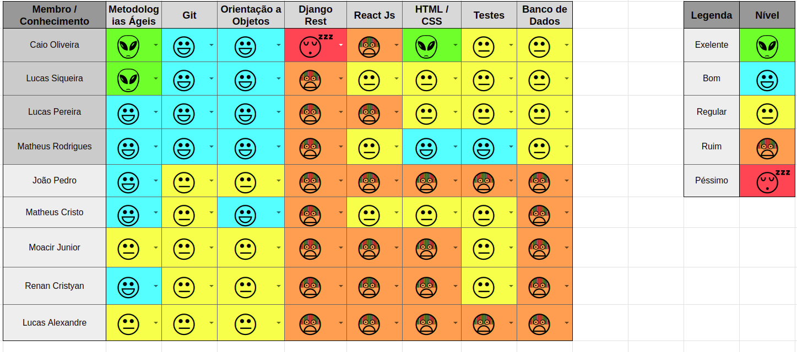
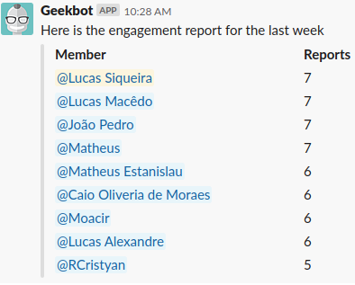

 

## 1. Resumo

 

- Período: 01/04 - 07/04
- Scrum master: Lucas Siqueira
- Product Owner: Caio Oliveira
- Devops: Matheus Rodrigues
- Arquiteto: Lucas Macedo

 

## 2. Resultados da sprint

 

### 2.1 Fechamento da Sprint

 

Tarefas|Status|Pontos
--|--|--
|[Descrição da metodologia](https://github.com/fga-eps-mds/2019.1-Hora-Da-Hora/issues/29)| Concluida | 2
|[Configurar ambiente de desenvolvimento do back-end](https://github.com/fga-eps-mds/2019.1-Hora-Da-Hora/issues/31)| Concluida | 5
|[Documento de arquitetura](https://github.com/fga-eps-mds/2019.1-Hora-Da-Hora/issues/28)| Concluida | 8
|[Folha de estilo](https://github.com/fga-eps-mds/2019.1-Hora-Da-Hora/issues/27)| Concluida | 2
|[Prototipo de alta fidelidade](https://github.com/fga-eps-mds/2019.1-Hora-Da-Hora/issues/30)| Concluida | 5
|[Documento de Abertura do Projeto](https://github.com/fga-eps-mds/2019.1-Hora-Da-Hora/issues/13)| Concluida | 2 
|[Refatorar Github Pages](https://github.com/fga-eps-mds/2019.1-Hora-Da-Hora/issues/14)| Não concluida | 5
|[Priorização](https://github.com/fga-eps-mds/2019.1-Hora-Da-Hora/issues/16)| Não concluida | 1
|[Documentos do scrum master sprint 2](https://github.com/fga-eps-mds/2019.1-Hora-Da-Hora/issues/22)| Concluida | 1
|[Dojo de Pytest](https://github.com/fga-eps-mds/2019.1-Hora-Da-Hora/issues/26)| Concluida | 3
|[Plano de Tempo](https://github.com/fga-eps-mds/2019.1-Hora-Da-Hora/issues/19)| Não concluida | 2

**Pontos Planejados:** 36

**Pontos Concluídos:** 28

### 2.2 Retrospectiva

 

|Membro|Pontos Positivos|Pontos Negativos|Sugestões de melhoria|
|---|------|-----|---|
|Lucas Siqueira| Maior entendimento da equipe em relação às metodologias ágeis, boa prototipação do produto, conclusão do backlog, importantes decisões tomadas. | Dívidas continuaram como dívida e as entregas não foram constantes. |Maior comprometimento na realização das tarefas.|
|Lucas Macêdo| Fechamento do backlog do produto, ambientes configurados para início da codificação. | Falta de comprometimento da equipe de EPS que deixou as mesmas histórias como dívida, demora na definição da logo e do novo nome do projeto. |Maior comprometimento da equipe de EPS.|
|Caio Oliveira| Fechamento do backlog  | Falta de proatividade da equipe de MDS e dívidas não resolvidas | Maior comprometimento para acabar com dívidas |
|Matheus Rodrigues| Fechamento do backlog e ambientes configurados | Dívidas não resolvidas | Foco nas reuniões |
|Moacir Junior| Dojo de testes, aprendi a utilizar o figma, ótimo pareamento no desenvolvimento do protótipo. | Dependência entre as issues e falta direcionamento na realização das tarefas. |Deixar menos dívidas.|
|João Pedro| Agora tenho um entendimento maior do projeto, todo mundo evoluiu em relação às metodologias ágeis, aprendi testes em python, bom engajamento nas dailys | Falta de tempo disponível para execução das tarefas |Dividir melhor o tempo para a realização das tarefas|
|Matheus Cristo| Aprimorei minhas técnicas de documentação, compreendi os padrões de codificação. | Demora nas entregas. | Melhor administração do tempo e comprometimento na entrega das tarefas. |
|Renan Cristyan| Dojo de teste, realização da folha de estilo, e maior entendimento da arquitetura na realização do documento. | Pouca efetividade no pareamento do desenvolvimento do documento de arquitetura. |Mais objetividade e diminuir brincadeiras durante os pareamentos.|
|Lucas Alexandre| Adquiri conhecimento básico em teste, ao fazer o protótipo elevei meu conhecimento acerca do projeto, tive um pareamento efetivo na realização do protótipo. | Dependência do PO na realização do protótipo. |Nenhuma.|

## 3. Quadro de conhecimento ao fim da sprint

 

## 4. Burndown
 

 

## 5. Velocity

 

 

## 6. Engajamento nas dailys

 

 

## 7. Feedback do Scrum Master

 

### 7.1 Análise dos riscos

 

**Riscos ocorridos durante a sprint:**

**R07 - Entregas atrasadas:**

Das dívidas anteriores, apenas uma foi cumprida, e as outras 2 se mantiveram como dívidas, e tivemos mais uma dívida dessa sprint, referente a refatoração do github pages, ocasionadas devido ao mal planejamento do tempo ao decorrer da sprint. 

As ações tomadas foram: Definir uma meta de priorizar essas tarefas logo no início da sprint, porém os pareamentos vão se manter.

**R08 - Dependência das atividades:**

Ocorreu a dependência do backlog para a realização da priorização e da descrição das histórias no documento de arquitetura, como era uma tarefa da issue do plano tempo, estava atrasada desde a sprint anterior.

As ações tomadas foram: Realizar o backlog em paralelo ao documento de arquitetura, e ao finalizar o backlog foi feito o tópico que estava faltando. Em relação à priorização não teve nenhuma ação tomada ao longa da sprint, porém como o backlog está pronto ela já pode ser feita.

### 7.2 Análise geral

 

Nessa sprint decisões importantes foram tomadas, a partir de uma avaliação de todo o grupo junto ao Product Owner foi definido que com as mudanças no escopo do projeto não teria mais sentido chamá-lo de Hora da hora, sendo assim definido um novo nome: +Monitoria, junto ao nome foi definida a logo do produto.

Outra definição extremamente importante da sprint foi o backlog, porém a demora na realização deste documento ocasionou na dívida do plano de tempo e da priorização, sendo que ele era um dos critérios de aceitação no desenvolvimento do plano de tempo e que para que a priorização ocorresse necessitava das histórias definidas, essa demora se deu ao fato da indisponibilidade do Product Owner ao longo da sprint.

Analisando o burndown, pode-se notar que a equipe não conseguiu ser produtivamente ágil ao longo da sprint, visto que a maioria das tarefas foi concluída no último dia da sprint e que não conseguimos concluir todas as atividades planejadas, porém a equipe se mantém unida e comprometida com o projeto, sempre tentando se ajudar á concluir as tarefas.

Em relação a comunicação da equipe, foi iniciado a documentação de engajamento das dailys. Nota-se que o engajamento está bom, porém alguns membros esqueceram de responder alguns dias. Outro ponto a comentar em relação a comunicação é que durante a semana ocorreu uma reunião de alinhamento com toda a equipe para atualizá-los decisões que estavam sendo tomadas.

Analisando o quadro de conhecimento nota-se que a equipe está cada vez mais se familiarizando com a metodologia adotada e que o dojo de testes em python foi extremamente produtivo, visto que ocorreu evolução em relação a esse conhecimento por todos.

Em relação ao velocity, percebemos que estamos planejando mais pontos do que estamos conseguindo entregar, visto isso, a próxima sprint será planejada com menos pontos, sendo prioritário a conclusão das dívidas que são as mesmas desde a sprint 1.

Apesar dos pontos citados, tem-se que essa sprint foi de extrema importância para o início do desenvolvimento do projeto, pois ocorreu a finalização do levantamento de requisitos junto à finalização da prototipação do produto, ocorreu a definição do backlog do produto, a priorização está encaminhada e será concluída o mais rápido possível, e o ambiente está configurado para dar início a codificação.

