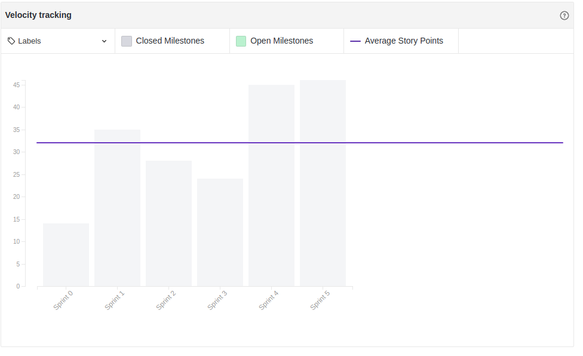
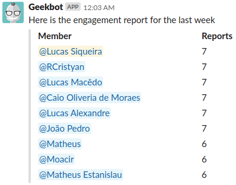

 

## 1. Resumo

 

- Período: 22/04 - 29/04
- Scrum master: Lucas Siqueira
- Product Owner: Caio Oliveira
- Devops: Matheus Rodrigues
- Arquiteto: Lucas Macedo

 

## 2. Resultados da sprint

 

### 2.1 Fechamento da Sprint

 

Tarefas|Status|Pontos
--|--|--
|[Disponibilizar autenticação por API externa](https://github.com/fga-eps-mds/2019.1-MaisMonitoria/issues/56)|Concluida | 8
|[Documentos do scrum master sprint 5](https://github.com/fga-eps-mds/2019.1-MaisMonitoria/issues/77)| Concluida | 1
|[Finalizar pipeline](https://github.com/fga-eps-mds/2019.1-MaisMonitoria/issues/74)| Concluida | 13
|[Testar Front-end](https://github.com/fga-eps-mds/2019.1-MaisMonitoria/issues/73)| Concluida | 5
|[Testar API monitoria](https://github.com/fga-eps-mds/2019.1-MaisMonitoria/issues/72)| Concluida | 3
|[Testar API gateway](https://github.com/fga-eps-mds/2019.1-MaisMonitoria/issues/71)| Concluida | 3
|[Integração front-end com back-end](https://github.com/fga-eps-mds/2019.1-MaisMonitoria/issues/70)| Concluida | 13

**Ponto Planejados:** 46

**Pontos Concluídos:** 46

### 2.2 Retrospectiva

 

|Membro|Pontos Positivos|Pontos Negativos|Sugestões de melhoria|
|---|------|-----|---|
|Lucas Siqueira| Foi feita a autenticação, conseguimos definir o roteiro da apresentação, e começamos a fazer os testes. | A equipe não está focada no que está fazendo. | Aumentar o nível de compromentimento da equipe. |
|Lucas Pereira| Resolvemos a autenticação. | Conhecimento da equipe não está homogeneo, está ficando muitas tarefas concentradas em poucas pessoas. | Tornar o conhecimento mais homogeneo. |
|Caio Oliveira| - | - | - |
|Matheus Rodrigues| Refatoração do frontend. | Ter que fazer refatorações que não eram pra ser necessárias. | Mais atenção ao fazer as tarefas. |
|João Pedro| - | - | - |
|Moacir Junior| Aprendi a fazer os testes do backend. | Ter demorado para aprender a fazer os testes. | Nenhuma. |
|Matheus Cristo| Pareamento efetivo e aprendizado em testes. | Devido a falta de conhecimento do codigo foi dificil fazer os testes. |  Nenhuma. |
|Renan Cristyan| Aprendi um pouco a fazer os testes do frontend. | Pareamento não efetivo, por causa da minha falta de foco. | Focar um pouco mais no meu pareamento. |
|Lucas Alexandre| - | - | - |

## 3. Quadro de conhecimento ao fim da sprint

 

## 4. Burndown
 

 

## 5. Velocity

 

 

## 6. Engajamento nas dailys

 

 

## 7. Feedback do Scrum Master

 

### 7.1 Análise dos riscos

Foi assumido o risco de planejar mais pontos, pois essa foi a ultima sprint antes da release 1
 

**R01 - Dificuldade com as tecnologias:**

Nessa sprint ocorreu a TS16 Finalizar Pipeline, que se deu á realizar o deploy no ambiente de homologação nesta tarefa, o nosso devops encontrou vários problemas com a tecnologia, por ser algo novo para ele.

As ações tomadas foram: Buscar ajuda no lappis para solucionar os problemas encontrados.

### 7.2 Análise geral

 

A sprint 5 foi fundamental para o planejado para release 1, com a integração do frontend com o backend foi possui ter algo funcional.

Analisando o velocity, houve o aumento das tarefas devido a proximidade da primeira apresentação do produto, foi entregue todos os pontos os planejados.

Em relação ao burndown nota-se que a equipe conseguiu fazer entregas ao longo do tempo, e o fato de termos feito uma sprint de 8 dias tornou possível a entrega de todas as tarefas.

Com o quadro de conhecimento ao final da sprint, podemos notar o aumento no conhecimento a cerca dos testes, pois tivemos historias dedicadas a eles, porém com o fim da integração do frontend com o backend não foi possível aproveitar todos os testes que foram feitos.

Para a próxima Sprint iremos focar na preparação para a apresentação da release 1, visando realizar ajustes finos na documentação, realizar os ajustes necessários para tornar o produto o mais apresentável possível, e treinar a equipe de MDS para a apresentação.

